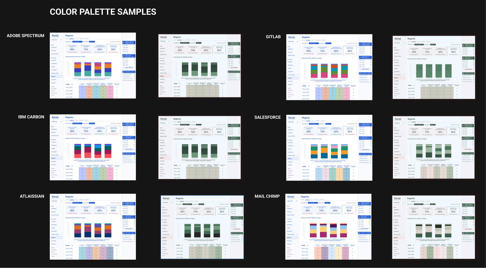
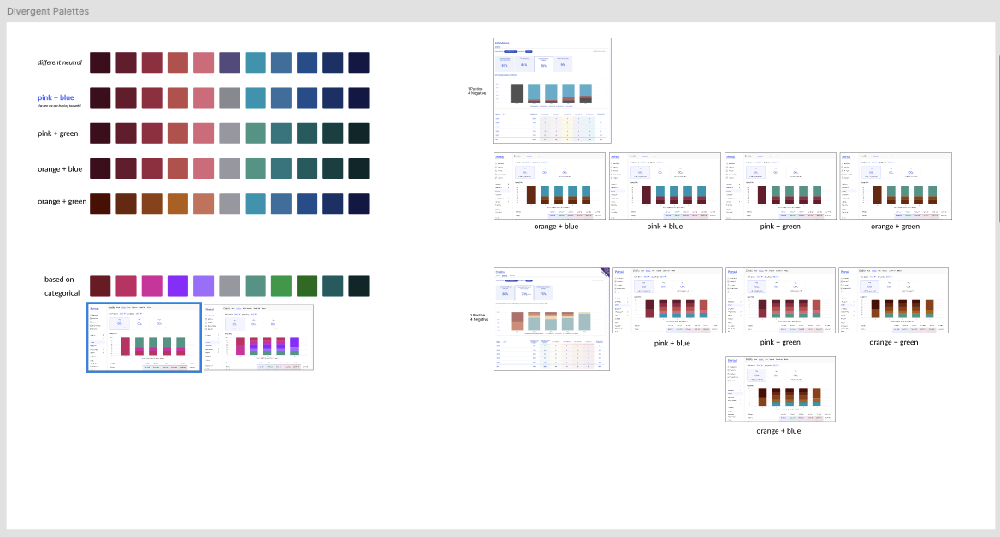
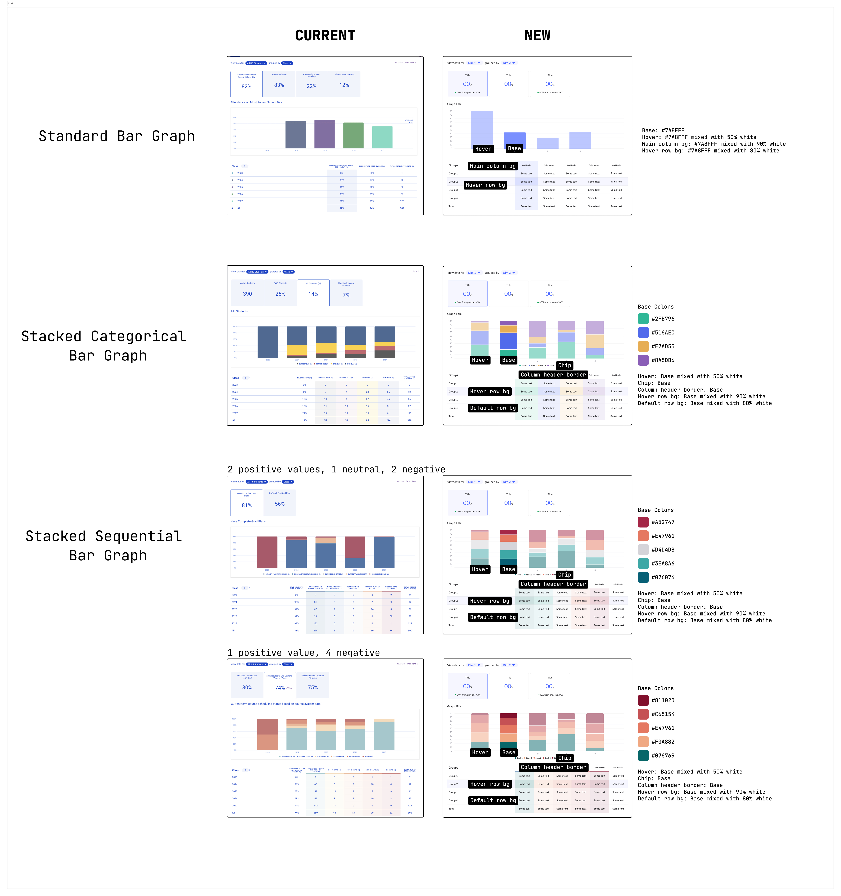
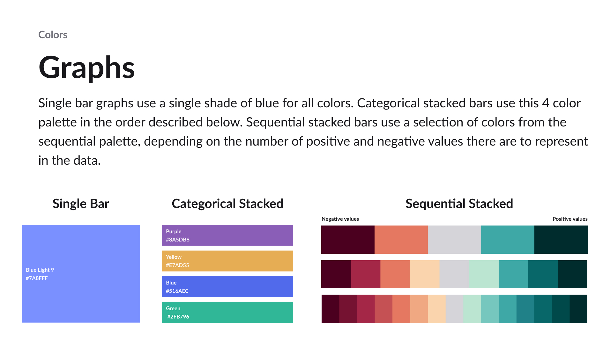

## The Challenge

As part of a wider product redesign the team decided to revisit our existing data vizualization library and look for opportunities to improve the visual design and ensure the graphs met accessibility standards. I led the design for this work, worked through the research, solution and implementation in partnership with engineering team members. This portion of the redesign lasted a few weeks, between proposing solutions, getting feedback from stakeholders and iterating based on that feedback.

## Research and Benchmarking

Our existing charting color library had been created by previous team members, and it was unclear what standards they met outside of their alignment to the style guide. One of the first steps was to understand current industry standards and to benchmark our existing color system.

I took at some popular design systems and read about different accepteance criteria for data visualization color systems. In my previous work on geospatial data visualization, I had remembered reading [Cynthia Brewer's work](https://colorbrewer2.org/#type=sequential&scheme=BuGn&n=3) on colors for cartogrpahy, and looked deeper into why the color pairs were chosen. I noticed they referenced sequential color palettes, and from there read through parts of [Fundamentals of Data Visualization](https://clauswilke.com/dataviz/) to get a better grasp on what the different standards and terms were in the data viz space. I also cross-referenced [WCAG 2.1 docs](https://www.w3.org/WAI/WCAG21/Understanding/non-text-contrast) to better understand what the contrast requirements were for non-text elements, as it wasn't something I was very familiar with. From this research I came up with a list of requirements for our new graph color palette:

- We needed 3 different color palettes for categorical data, sequential data, and divergent data
- Graph elements needed a 3:1 contrast ratio from neighboring graph elements
- The color palettes would need to be tested against [common color vision impairments](https://www.colourblindawareness.org/colour-blindness/colour-blindness-experience-it/)

### Ideating

After understanding the requirements and success criteria I set out to find out how other orgs had solved this problem within their design systems. I compiled color palettes from orgs like Adobe, IBM, and Gitlab and applied them to a sample screen from our product to better understand what sort of change this would be. I also passed these initial tests through a color blindness filter to start getting familiar with the toolset. None of these palettes would fit naturally within our brand, but they were helpful in identifying the different types of solutions out there.

### Our New Colors

With an idea of what the outcome should look like, I divided the work into 2 main approaches. Defining a categorical color palette that pulls in a brand color and builds off that color. And defining a divergent color palette which could be segmented in order to create a sequential palette. I also noticed our standard bar graph was using multiple colors when it was plotting a single data point across groups, and this seemed to be an anti-pattern from my research, so I included updating this to a brand color as part of this work.

For the cateogrical pallete, I started with one of the lighter shades of our main brand blue, and then adjusted the hue in HSL to find colors that were complementary in weight to the original color but distinct in their hue value. I tested these different options against various forms of color blindness and landed on a solution that met the requirements and integrated nicely into our existing brand.

The divergent palette was a challenge in that there were multiple variations of underlying data this would be applied to. There were scenarios where the data reflected 1 positive value and 4 negative, 2 positive a nuetral and 2 negative, and others. Because of this variation and wanting to future proof this work, I landed on an approach that defined a base sequential palette, and a couple variations where additional steps were added to the scale.

Feeling confident in the research I did, and sharing the requirements for the definition of these palettes, it was fairly easy to get buy in on the proposal. We were able to move forward with this update to the design system and carding the changes for the engineering team. As part of sharing this with the engineering team I put together some documents to help communicate which palette and variation should be applied in which context.

## Results

With our new color palettes available for the design team to use in any future charting projects, we've been able to reduce future decision making while confidently providing an experience we know is accessible to users of varied visual ability. One of the challenges with the data in our product, is the unkown scale of data points we'll need to plot in future work. The categorical scale inluded up to 4 colors, with the intention being if additional colors are needed it should warrant a conversation about the data grouping and whether it is possible to create parent groups in the data set. It was challenging to create a wide ranging divergent scale that could meet data viz guidelines, be visually harmonious in our design system, and adhere to accessibility requirements. In my research I found that adding a gap between bar graph groups is a way ensure users can see the distinction between adjoining segments, so we added that in our graph update as well. Since this project has launched it has been leveraged several times in other projects, and I'm proud of how we were able to put accessibility first in this work.
