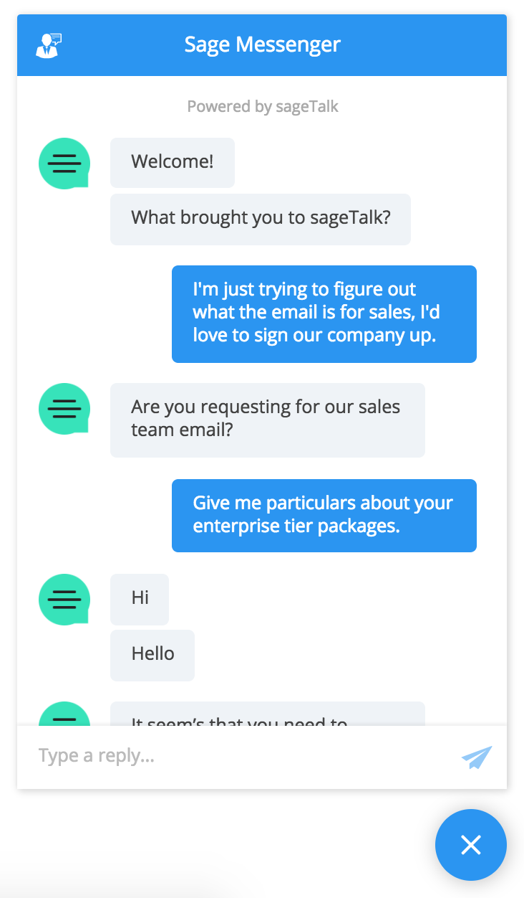
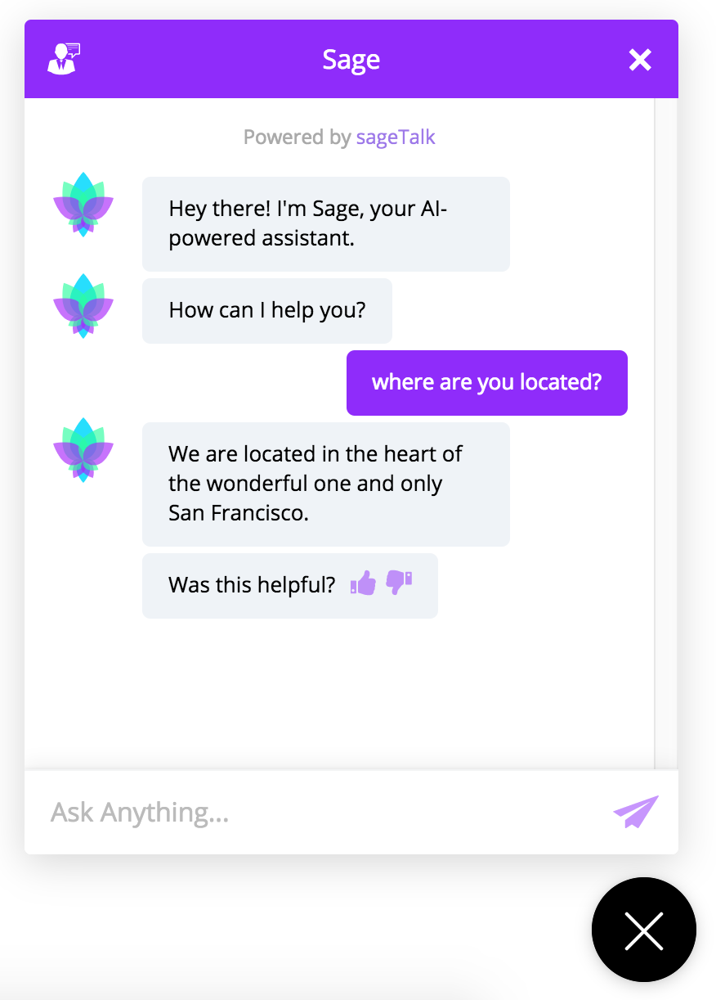

SageTalk, the first product from SageAI is a machine learning and natural language processing customer service chatbot. I was brought onto the team after an MVP had been created. The first challenge was to look for ways to modernize the UI and improve the UX for administering the bot and for the end user interacting with the bot.

## Original Design

My first step in this process was to learn what features the current beta customers were asking for and what paint points they currently had. This feedback combined with the client manager's input, let me form a short list of possible features. Secondly, I took a look at the competitive landscape and measured our product against those. Looking for where we were falling short as well as where there was an opportunity to pioneer a feature in the space. From here I organized a set of cards in Trello and came up with the following list.

- Create a more native looking UI when using the chatbot on mobile.
- Increase animation speed timing to improve the feeling of responsiveness.
- Improve the separation of the chatbot from the page it resides on.
- Allow branding customization of the chatbot.

## Priority Setting

Working with the founder and engineers, we planned out which features should come first in terms of biggest impact for our customers. We wanted to determine features we would be able to ship quickly and allow us to broaden our potential customer base. The ability to customize the chatbot is a big selling point, but also has the heaviest development lift. For the sake of maintaining a good pace we decided to work on the general styling

## Wireframes

Using Axure to create the wireframes, I prototyped a few solutions based on feedback and came up with the following. A prominent placement for the logo which would allow numerous logo sizes to work. A clear header section distinguishing primary and secondary navigation elements, and below that are featured stories. Sticking to a 2 column layout allows us to put greater emphasis on the content and use the single sidebar as a utility area actionable items such as newsletter signups and most popular content.

